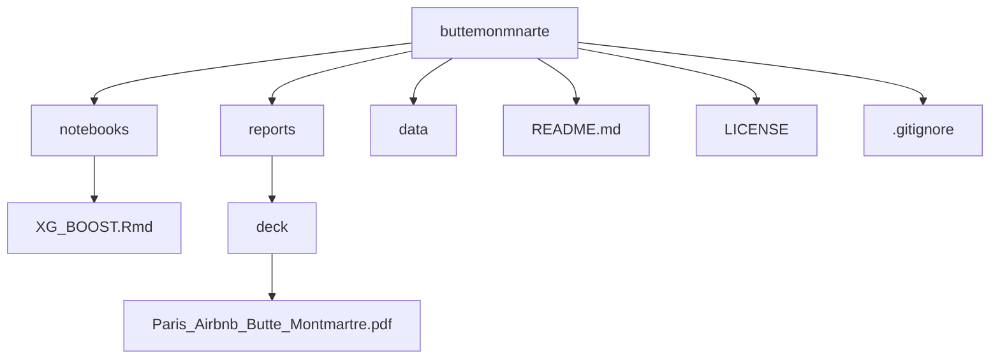

# Paris Airbnb Analysis — Butte Montmartre

## 📌 Project Overview
This project analyzes Airbnb listings in **Butte Montmartre, Paris**, with a focus on understanding what factors drive high booking rates and how hosts can optimize their pricing and amenities.  
We used **R (R Markdown), Python, and machine learning models** to study 5,900 listings, evaluate seasonal demand, and generate insights for both new and experienced hosts.

---

## 🎯 Objectives
- Analyze **market trends** and seasonal demand shifts (e.g., Fashion Week, Harvest Festival).
- Identify **features and amenities** (balcony, garden, Wi-Fi, elevator, etc.) that boost bookings.
- Apply **machine learning models** (XGBoost, CatBoost, LightGBM, Random Forest) to predict booking probability.
- Recommend **pricing strategies** to balance competitiveness and profitability.
- Highlight **risks and rewards** for investors in Paris Airbnb properties.

---

## 📂 Repository Structure

---

## 📊 Data
- **Dataset**: ~5,900 Airbnb listings in Butte Montmartre, Paris (Airbnb open data).  
- **Features studied**:
  - Property type, bedrooms, accommodates  
  - Amenities: balcony, garden, Wi-Fi, breakfast, pets, elevator  
  - Host response rates & ratings  
  - Pricing, fees, and occupancy  
  - Location coordinates (used for mapping)  

---

## 🧪 Models & Methods
### Models tested:
- ❌ LDA → poor performance  
- ❌ Random Forest → moderate (Accuracy ~83.6%, Specificity ~92.7%)  
- ✅ LightGBM → competitive performance  
- 🌟 **XGBoost & CatBoost** → best models, high accuracy and predictive power  

### Key metric:  
- **Specificity** was chosen to avoid investing in low-booking properties.

---

## 📈 Key Insights
- **Seasonal demand**:  
  - Occupancy peaks in **September–October (~80%)**.  
  - Driven by major events (Fashion Week, Harvest Festival).  

- **Amenities that boost bookings**:  
  - Balcony, garden, scenic views  
  - High host response rates (~100%) strongly correlate with bookings  
  - Wi-Fi and elevators are also important for guest choice  

- **Pricing strategy**:  
  - Overpricing reduces demand in a highly competitive market  
  - Listings near attractions perform best when priced at **reasonable value**  

- **Risks**:  
  - Currency exchange fluctuations affect tourism  
  - Paris has strict short-term rental regulations and licensing requirements  

- **Rewards**:  
  - Consistent demand for listings near attractions (Basilica, Metro)  
  - Performance-driven growth from responsive, value-driven hosts  

---

## 🛠️ Tools & Technologies
- **Languages**: R, Python  
- **Libraries**: xgboost, catboost, lightgbm, caret, tidyverse, leaflet, matplotlib, ggplot2  
- **Visualization**: Plots, geospatial maps (leaflet)  
- **Collaboration**: GitHub, RStudio  
- **Deliverables**: Final PDF presentation, R Markdown notebook, visualizations  

---

👥 Team

Abhigna Valambatla

Kamala Priya Annavarapu

Gokul Varatharasan

Caleigh Patterson
